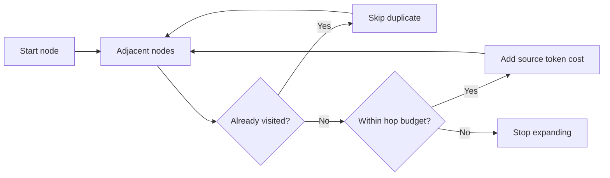
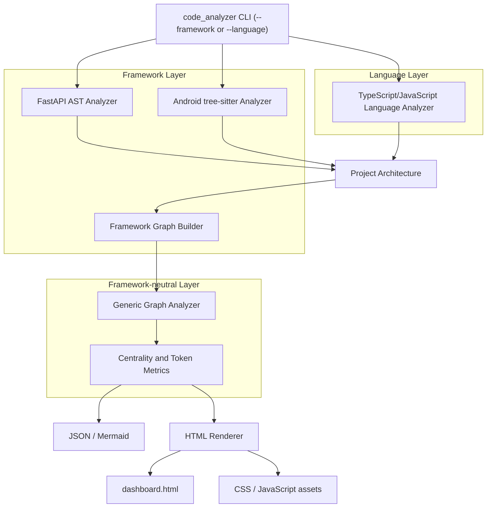

# Agent-Friendly Repository Analyzer

> AI 코딩 에이전트가 저장소를 탐색할 때 어디에서 문맥과 토큰을 낭비하는지 정적 분석으로 찾는 프로젝트입니다. FastAPI(Python)를 첫 번째 프레임워크 사례로, Android(Kotlin)를 두 번째 사례로 지원합니다.

이 프로젝트는 코드의 전통적인 복잡도보다 **에이전트가 작업 대상을 찾고 영향 범위를 확신하기까지 지불하는 탐색 비용**에 집중합니다. AST로 애플리케이션 구조를 복원하고, 이를 그래프로 변환한 뒤 중심성·소스 토큰 비용·2/3-hop 문맥 비용을 결합해 탐색 병목을 찾습니다.

## 왜 만들었나

AI 에이전트는 코드를 수정하기 전에 반복적으로 검색하고 파일을 읽습니다. 이때 사람이 보기에는 정상적인 구조도 에이전트에게는 비쌀 수 있습니다.

- 여러 기능에서 참조하는 핵심 파일이 너무 커서 매번 많은 토큰을 소비한다.
- 등록 코드와 실제 구현이 떨어져 있어 여러 파일을 왕복한다.
- dependency injection, decorator, re-export처럼 언어 수준의 import/call만으로 연결을 찾기 어렵다.
- fan-out이 큰 허브에서 관련 없는 후보까지 탐색한다.
- 변경 영향과 테스트를 확인하기 위해 2-hop, 3-hop 이웃을 넓게 읽는다.

기존 정적 분석 도구는 순환 복잡도, 중복, lint 위반처럼 코드 자체의 품질을 주로 측정합니다. 이 프로젝트는 관점을 바꿔 다음 질문에 답하려고 합니다.

> “이 저장소에서 에이전트가 올바른 수정 지점과 영향 범위를 찾는 데 얼마나 많은 문맥이 필요한가?”

## 현재 구현 범위

### TypeScript / JavaScript

- Framework-neutral `.ts`, `.tsx`, `.js`, `.jsx`, `.mjs`, and `.cjs` analysis
- File, class, function, and method symbols
- ES module import/export, class inheritance, and call relationships

### FastAPI (Python)

- Python `ast` 기반 정적 분석
- FastAPI app, nested router, endpoint, middleware 추출
- `Depends`, `Security`, `Annotated` 기반 dependency chain 복원
- Pydantic·SQLModel schema와 request/response 연결
- app → router → endpoint → dependency/schema 방향 그래프 생성

### Android (Kotlin)

- `tree-sitter` 기반 `.kt` 정적 분석 (`pip install -r requirements.txt` 필요)
- Jetpack Compose `@Composable` 함수와 호출 그래프 추출
- Hilt/Dagger DI(`@Module`/`@Provides`/`@Binds`/`@HiltViewModel`/`@Inject`) 그래프 복원
- ViewModel ↔ UI(Composable) 연결 추적
- Room(`@Entity`/`@Dao`/`@Database`)과 쿼리·엔티티 연결
- Retrofit API 인터페이스(`@GET`/`@POST` 등) 추출

### 공통

- PageRank, HITS, degree/betweenness centrality 계산
- 소스 범위의 추정 토큰 비용과 PageRank 가중 비용 계산
- 각 노드에서 2-hop·3-hop 탐색 시 필요한 누적 토큰 비용 계산
- Git working tree 또는 최근 commit 간 architecture diff
- JSON, Mermaid, 대화형 HTML dashboard 출력

FastAPI와 Android는 최종 목적이 아니라 프레임워크가 숨기는 연결을 분석 코어에 보강하는 **reference adapter**입니다. 범용 symbol graph와 다른 프레임워크 adapter는 다음 단계입니다.

## 분석 방법론

### 1. 코드를 속성 그래프로 변환

현재 FastAPI adapter는 다음 요소를 노드와 방향성 edge로 변환합니다.

| 구분 | 내용 |
|---|---|
| Node | application, router, endpoint, dependency, schema, middleware |
| Edge | `INCLUDES`, `ROUTES`, `DEPENDS_ON`, `SUB_DEPENDENCY`, `REQUEST_BODY`, `RESPONSE_MODEL`, `MIDDLEWARE_OF` |
| Node attributes | 파일 경로, line number, category, source token cost, 분석 지표 |

대규모 저장소에서 대부분의 노드는 일부 노드하고만 연결되므로 dense adjacency matrix 대신 adjacency set을 사용합니다. PageRank와 HITS에는 edge 방향을 유지하고, 에이전트가 정의와 사용처를 양방향으로 탐색하는 상황을 근사할 때는 undirected neighborhood를 사용합니다.

### 2. 중요한 노드와 비싼 노드를 구분

한 가지 지표로 구조를 좋고 나쁘다고 판정하지 않습니다.

| 지표 | 해석 |
|---|---|
| PageRank | 중요한 노드로부터 반복적으로 도달하는 핵심 대상 |
| Hub score | 여러 중요한 대상으로 탐색을 분배하는 출발점 |
| Authority score | 여러 허브가 참조하는 핵심 대상 |
| Degree centrality | 직접 연결이 집중된 정도 |
| Betweenness centrality | 서로 다른 영역 사이의 최단 경로가 집중되는 병목 |
| Token cost | 해당 노드를 이해하기 위해 읽어야 할 소스 크기의 근사치 |
| Weighted centrality cost | `PageRank × token cost`; 자주 필요하면서 읽기까지 비싼 대상 |
| 2/3-hop token cost | 주변 영향 범위를 탐색할 때 필요한 중복 제거 문맥 비용 |

PageRank가 높다는 사실만으로 리팩터링 대상은 아닙니다. 작고 중심적인 인터페이스는 좋은 설계일 수 있습니다. 반대로 **중심성이 높고 토큰 비용도 큰 노드**, **betweenness가 높은 거대 브리지**, **3-hop 비용이 급증하는 허브**를 우선 조사 대상으로 봅니다.

### 3. 토큰 비용 추정

각 graph node의 파일과 line number를 이용해 그 줄을 포함하는 가장 작은 함수·클래스·할당 AST 범위를 찾습니다. 현재 기본 추정은 다음과 같습니다.

```text
estimated_tokens = ceil(source_characters / 4)
```

파일을 찾을 수 없거나 AST 범위를 결정할 수 없으면 node metadata를 이용해 비용을 근사합니다. 이 값은 특정 LLM tokenizer의 정확한 토큰 수가 아니라 저장소 내부 대상을 상대 비교하기 위한 초기 지표입니다. `GraphAnalysisConfig.characters_per_token`으로 조정할 수 있습니다.

### 4. AI code exploration 모방

현재 구현은 각 노드를 탐색 시작점이라고 가정하고 다음 과정을 반복합니다.



- dependency를 따라 구현으로 이동하는 탐색과 caller를 찾아 영향 범위를 확인하는 탐색을 모두 반영하기 위해 edge를 양방향으로 봅니다.
- 같은 노드는 한 번만 계산해 중복 문맥 비용을 제거합니다.
- 2-hop과 3-hop에서 도달한 node 수와 토큰 비용을 각각 기록합니다.
- 연결되지 않은 node와 hop budget 밖의 node는 읽지 않는 것으로 처리합니다.

즉, 현재의 read/skip 판단 기준은 **그래프 연결성, 방문 여부, hop budget**입니다. 아직 작업 설명이나 오류 메시지와의 semantic relevance를 사용해 이웃 중 일부만 선택하지는 않습니다.

목표 모델에서는 실제 에이전트처럼 작업 단서에서 seed node를 찾고, frontier의 각 후보를 다음과 같이 평가할 예정입니다.

```text
read_utility = task_relevance + edge_confidence + impact_value - normalized_token_cost
```

예산 안에서 utility가 높은 후보만 읽고, 구현 지점·영향 범위·관련 테스트에 대한 충분한 evidence가 모이면 탐색을 종료합니다. 실제 agent trace와 비교해 각 가중치를 보정하는 것이 장기적인 검증 목표입니다.

## 동작 구조

분석, 프레임워크 의미 해석, 출력 계층은 서로 분리되어 있습니다.



```text
analysis/                         # 프레임워크 비종속 그래프 지표
code_analyzer/                    # CLI와 전체 파이프라인 조합
language_analyzers/core/           # graph/report/git-diff 모델
language_analyzers/python/         # Python source discovery and parsing
language_analyzers/kotlin/         # Kotlin syntax helpers
language_analyzers/typescript/     # TypeScript/JavaScript symbol graph
framework_analyzers/fastapi/       # FastAPI 의미 해석; Python language layer에 의존
framework_analyzers/android/       # Android 의미 해석; Kotlin language layer에 의존
renderers/html/             # HTML template, CSS, JavaScript, renderer (프레임워크 중립)
tests/                      # 분석·패키지 경계·통합 테스트
```

Language analyzers never import framework analyzers. A framework analyzer can add framework-specific semantics on top of its language layer, so it can be replaced without changing the language graph or generic output layers.

## 설계에서 고민한 점

### 프레임워크 지식과 범용 지표 분리

`Depends`, router registration 같은 FastAPI 연결이나 `@Composable`, Hilt `@Inject` 같은 Android 연결은 언어 문법만으로 충분히 복원하기 어렵습니다. 이 의미는 각각 `framework_analyzers/fastapi/`와 `framework_analyzers/android/`가 각 언어 계층 위에 보강하고, PageRank나 hop cost는 두 패키지 모두 import하지 않는 `analysis/`가 계산합니다. graph node/edge, git-diff 추출, dashboard report 스키마는 `language_analyzers/core/`에 둡니다.

### 분석과 표현 분리

HTML, CSS, JavaScript를 Python 문자열에 넣지 않았습니다. renderer는 프레임워크마다 스스로 선언하는 `ReportCollection`(예: FastAPI의 endpoints/routers, Android의 composables/room entities)을 순회해 template placeholder를 채우며, 정적 자산은 별도 파일로 관리합니다. renderer는 특정 프레임워크의 어휘를 하드코딩하지 않으므로 같은 분석 결과를 향후 CLI, JSON, 다른 UI, 다른 프레임워크 adapter에서 재사용할 수 있습니다.

## 검증

```bash
python3 -m unittest discover -s tests -v
```

테스트는 다음 경계를 확인합니다.

- FastAPI route, dependency, schema 추출과 nested prefix 해석
- Android Compose/Hilt-Dagger/Room/Retrofit 추출과 그래프 연결
- TypeScript/JavaScript file, symbol, import/export, inheritance, call 관계 추출
- PageRank·HITS·betweenness·hop token cost 계산, 정확한 소스 범위가 주어졌을 때의 토큰 비용 우선순위
- 언어 계층이 framework analyzer를 import하지 않는지 여부
- HTML이 sibling CSS/JS asset을 생성하고 참조하는지 여부
- Git working tree와 commit diff가 architecture component에 연결되는지 여부

샘플 프로젝트는 `examples/official_template`, `examples/realworld_app`(FastAPI), `examples/nowinandroid_sample`(Android, `examples/download_android_samples.py`로 받음)에 포함되어 있습니다.

## 한계

- 현재 graph node는 모든 파일·함수·클래스가 아니라 각 프레임워크의 architecture component 중심입니다.
- 동적 import, reflection, monkey patching, 문자열 기반 registration은 정적으로 완전히 복원할 수 없습니다.
- Android 추출은 어노테이션·상위타입 이름 매칭에 의존하는 heuristic이며 (FastAPI의 기존 방식과 동일한 한계), wildcard import로 인한 이름 충돌을 완전히 구분하지 못합니다.
- Android 트랙은 `.kt` 소스만 다루며 `AndroidManifest.xml`이나 Navigation graph XML은 아직 분석하지 않습니다.
- 토큰 비용은 문자 수 기반 근사치이며 모델별 tokenizer 차이를 반영하지 않습니다.
- 2/3-hop 탐색은 topology 기반 근사로, 실제 에이전트의 semantic search와 tool 선택을 재현하지 않습니다.
- exact betweenness 계산은 매우 큰 graph에서 비용이 커질 수 있습니다.
- HTML dashboard의 외부 CDN 자산은 offline 환경에서 별도 bundling이 필요합니다.

## 다음 단계

1. 일반 Python/Kotlin file/module/class/function symbol graph 추가
2. import, call, inheritance, type use, test-to-production edge 확장
3. 작업 설명·오류 메시지에서 seed node를 찾는 retrieval 계층 추가
4. relevance와 token budget을 결합한 확률적 exploration policy 구현
5. 실제 agent의 파일 열기·검색·backtracking trace로 지표 보정
6. Git co-change와 정적 dependency 불일치 탐지
7. Django, Flask 등 다른 Python framework adapter, AndroidManifest/Navigation 분석 추가
8. 변경 전후 agent-friendliness diff와 개선 제안 제공

더 자세한 제품 가설과 열린 질문은 [IDEA.md](IDEA.md)에 정리되어 있습니다.
